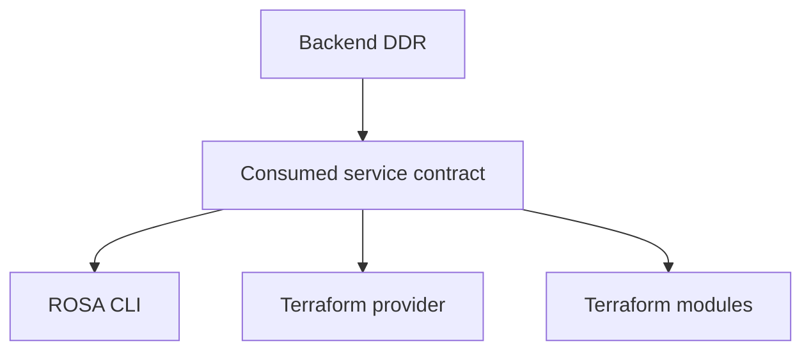

# AWS Spot for ROSA HCP: Client Integration Contract

## Define the ROSA CLI and Terraform client contract that complements the Backend DDR

# Executive Summary

This document is the client-only companion to the [Backend DDR](https://github.com/openshift-online/rosa-enhancements/pull/34). That Backend DDR owns the broad platform design for Spot on ROSA HCP, including HyperShift behavior, queue-driven interruption handling, and hosted control plane orchestration.

This enhancement document only defines the client-facing contract for ROSA CLI, `terraform-provider-rhcs`, and the Terraform modules. Its job is to describe how those clients should expose Spot-backed HCP NodePools consistently once the required service and API shape exists, without repeating the full backend design.

# What

This document defines how Spot support for ROSA HCP should be exposed through ROSA CLI and Terraform surfaces.

**Client surfaces in scope:**

- ROSA CLI
- `terraform-provider-rhcs`
- `terraform-rhcs-rosa-hcp`
- `terraform-rhcs-rosa-classic` as naming precedent only

**Assumptions inherited from the Backend DDR:**

1. Any HCP NodePool may use Spot. Backend topology validation requires the cluster to retain at least one NodePool with 2 untainted replicas; market type (on-demand vs. Spot) is not part of that check.
2. Queue URL is **always optional**. The presence or absence of a queue URL determines the configuration mode (Simple or Enhanced).
3. No taints are applied to Spot NodePools by default. Customers manage workload placement via node selectors, affinity, or manually applied taints.
4. Backend topology validation enforces the 2-untainted-replica invariant; clients should surface resulting errors clearly.
5. Minimum OCP version 4.22 is required for Spot support.
6. HCP Spot configuration is represented through the OCM API shape for HCP clusters and NodePools, not through the legacy classic machine-pool shape.

## User Stories

* As a ROSA CLI user: I want to use the same Spot flags I already know from ROSA classic when creating additional HCP NodePools.
* As a ROSA CLI user: I want to quickly create Spot NodePools without any queue setup (Simple mode) for non-critical workloads.
* As a ROSA CLI user: I want cluster create/edit commands to accept an optional queue URL to enable graceful interruption handling (Enhanced mode).
* As a ROSA CLI user: I want to upgrade from Simple mode to Enhanced mode by adding a queue URL as a day-2 operation.
* As a Terraform provider consumer: I want `rhcs_hcp_machine_pool` and `rhcs_cluster_rosa_hcp` to expose Spot and queue configuration in shapes that match the OCM API.
* As a Terraform module user: I want the official HCP module to expose Spot and queue inputs without forcing me into classic-only field shapes.
* As a ROSA CLI or Terraform maintainer: I want lifecycle semantics, validation, warnings, examples, and tests to be clearly defined so client behavior stays consistent.

# Why

The Backend DDR already explains why Spot support matters for ROSA HCP as a product capability. The narrower reason for this companion document is different: ROSA CLI, Terraform provider, and Terraform modules need one explicit client contract so they all expose the same HCP Spot behavior without reinterpreting the platform design independently.

Without that narrower contract, the likely failure modes are:

- CLI preserves classic naming while Terraform invents a different HCP shape
- the official HCP module lags the provider and publishes incomplete examples
- clients imply update semantics that the service does not actually support
- warning behavior around the queue-optional model becomes inconsistent across clients

## Goals

1. Define the consumed HCP Spot contract that ROSA CLI and Terraform surfaces should expose.
2. Preserve ROSA classic Spot naming parity for ROSA CLI where that improves migration and script compatibility.
3. Preserve the HCP nested `aws_node_pool` Terraform shape rather than flattening HCP Spot into classic-style fields.
4. Make lifecycle semantics explicit for clients, including that Spot updates on existing NodePools are disruptive recycle/replace operations.
5. Clearly communicate the two configuration modes (Simple and Enhanced) and the day-2 upgrade path.
6. Identify the exact client-facing gaps in ROSA CLI, `terraform-provider-rhcs`, and the official HCP Terraform module.
7. Keep just enough dependency context to explain which client work is blocked on upstream API/model shape.

## Non-Goals

- Re-documenting AWS Spot background, Node Termination Handler internals, queue/event orchestration, or full hosted control plane architecture from the Backend DDR
- Defining OCM UI behavior in detail
- Replacing the Backend DDR
- Providing seamless or zero-downtime Spot configuration changes on existing HCP NodePools (updates are disruptive recycle/replace operations)
- Flattening HCP Terraform Spot input into classic-style `use_spot_instances` and `max_spot_price` fields for additional HCP NodePools

# How

## Relationship to the Backend DDR

The [Backend DDR](https://github.com/openshift-online/rosa-enhancements/pull/34) is the source of truth for backend and platform behavior. This companion only defines how clients consume that design.



## Configuration Modes

Clients expose two configuration modes, determined by the presence or absence of a cluster-level SQS queue URL:

| Mode | Queue URL | Graceful Draining | Client Behavior |
| :--- | :--- | :--- | :--- |
| **Simple** | Not provided | No (MachineHealthCheck handles replacement reactively) | Clients emit an informational warning when creating a Spot NodePool |
| **Enhanced** | Provided via `aws.termination_handler_queue_url` | Yes (AWS Node Termination Handler drains within 2-min window) | Spot NodePools created without additional warnings |

The queue URL is **always optional**. There is no support exception or capability required to use Simple mode. Clients should:
- Allow Spot NodePool creation regardless of queue presence
- Surface an informational warning (not error) when queue URL is absent
- Support day-2 upgrade from Simple to Enhanced via cluster PATCH

## Queue Setup Responsibilities and Defaults

Enhanced mode depends on customer-side AWS resources. Clients should describe and, where supported, automate the same queue setup validated by the Backend DDR and PerfScale testing:

- use a **standard SQS queue** (not FIFO)
- use **AWS default queue attributes** unless backend guidance later changes
- tag the queue with `red-hat=true`
- apply a queue resource policy that allows the cluster's NodePoolManagement role to call `sqs:DeleteMessage` and `sqs:ReceiveMessage`
- configure EventBridge to forward `EC2 Spot Instance Interruption Warning` and `EC2 Instance Rebalance Recommendation` events to the queue
- support both **manual setup** and **supported automation/helper paths**

Queue, policy, and EventBridge resources are created by ROSA CLI, Terraform, or the customer directly, not by OCM. OCM's role is limited to accepting, validating, storing, and propagating `aws.termination_handler_queue_url`.

## Consumed Service Contract

This companion assumes the service exposes:

1. **Cluster-level queue configuration** (optional, enables Enhanced mode)

```json
POST /api/clusters_mgmt/v1/clusters
{
  "name": "rosa-hcp-spot",
  "hypershift": {"enabled": true},
  "aws": {
    "termination_handler_queue_url": "https://sqs.us-east-1.amazonaws.com/123456789012/rosa-cluster-spot"
  }
}
```

Day-2 upgrade from Simple to Enhanced:

```json
PATCH /api/clusters_mgmt/v1/clusters/{cluster_id}
{
  "aws": {
    "termination_handler_queue_url": "https://sqs.us-east-1.amazonaws.com/123456789012/rosa-cluster-spot"
  }
}
```

2. **NodePool-level Spot configuration**

```json
POST /api/clusters_mgmt/v1/clusters/{cluster_id}/node_pools
{
  "id": "spot-workers",
  "aws_node_pool": {
    "instance_type": "m5.xlarge",
    "spot_market_options": {
      "max_price": "0.50"
    }
  }
}
```

For clients, the important rules are:

1. Any HCP NodePool may use Spot. Backend topology validation requires the cluster to retain at least one NodePool with 2 untainted replicas; market type is not part of that check.
2. Queue URL is always optional. Its absence puts the cluster in Simple mode with a warning.
3. `max_price` is optional. When unset, clients should omit the field or send `null`; the backend applies the on-demand price ceiling by default.
4. Spot and capacity reservation must not be allowed together on the same HCP NodePool.
5. Backend topology validation enforces the 2-untainted-replica invariant; clients should surface resulting errors clearly rather than defining a stronger client-owned guard.
6. Minimum OCP version 4.22 is enforced by the service.

## Spot Lifecycle Semantics

Spot configuration on an HCP NodePool is **mutable, but updates are not in-place instance mutations**. Changing Spot enablement or `max_price` on an existing NodePool triggers a recycle/replace of the underlying worker instances.

Clients should:

- allow day-2 updates to Spot configuration on existing HCP NodePools
- clearly communicate that such updates are disruptive and will recycle the affected worker instances
- avoid implying that Spot changes are seamless or zero-downtime

## ROSA CLI Contract

### Current state

- The shared `rosa create machinepool` surface already contains classic Spot naming precedent via `--use-spot-instances` and `--spot-max-price`.
- The HCP node-pool implementation path currently exposes other HCP-specific AWS settings such as capacity reservation, IMDS, disk size, and security groups, but not Spot.
- HCP cluster create/edit surfaces currently do not expose a queue URL flag.

### Client contract

The CLI should preserve classic naming for HCP create-time Spot exposure:

- `rosa create machinepool --use-spot-instances`
- `rosa create machinepool --spot-max-price`
- `rosa create cluster --spot-termination-queue-url` (optional, enables Enhanced mode)
- `rosa edit cluster --spot-termination-queue-url` (day-2 upgrade to Enhanced mode)

**Simple mode example** (no queue, immediate Spot):

```bash
rosa create cluster my-cluster
rosa create machinepool --cluster my-cluster --use-spot-instances --spot-max-price 0.50 spot-workers
# → WARNING: "Spot NodePool created without termination handler configuration.
#    Nodes will not be gracefully drained on interruptions."
```

**Enhanced mode example** (with queue, graceful draining):

```bash
rosa create cluster my-cluster \
  --spot-termination-queue-url https://sqs.us-east-1.amazonaws.com/123456789012/rosa-cluster-spot
rosa create machinepool --cluster my-cluster --use-spot-instances --spot-max-price 0.50 spot-workers
# → Success: Graceful handling enabled
```

**Day-2 upgrade** (Simple to Enhanced):

```bash
rosa edit cluster my-cluster \
  --spot-termination-queue-url https://sqs.us-east-1.amazonaws.com/123456789012/rosa-cluster-spot
# → Existing and new Spot NodePools now have graceful handling
```

**Required for GA: automated queue setup helper**

```bash
rosa create spot-termination-queue --name my-cluster --mode auto
# → Creates the SQS queue, applies the queue resource policy, configures the EventBridge
#   rule/target, and returns the queue URL for use with `rosa create cluster` or `rosa edit cluster`
```

Customers may still create these resources manually. The GA requirement is that ROSA CLI provides a supported automated path for customers who do not want to assemble the queue and EventBridge configuration themselves. The helper should not require a cluster to exist first, so the same flow can support both day-0 cluster creation and later day-2 configuration updates.

**Recommended helper behavior** (aligned to the Backend DDR and PerfScale-tested setup):

- queue tag: `red-hat=true`
- accept an optional `--name` used as a prefix for created resources
- create a standard SQS queue with AWS default attributes
- apply the required queue resource policy for the cluster's NodePoolManagement role
- do not attach temporary IAM permissions to the NodePoolManagement role as part of this helper; until the managed policy is available, any interim IAM policy attachment remains a customer-managed step
- EventBridge pattern should follow the current Backend DDR spot interruption events:
  - `EC2 Spot Instance Interruption Warning`
  - `EC2 Instance Rebalance Recommendation`

This client contract does not publish custom SQS attribute overrides because the PerfScale team validated the standard queue/AWS-default configuration. It also does not prescribe the helper's internal implementation mechanism (for example, a template-driven flow); it only defines the expected CLI behavior and produced resources.

The CLI should also:

- surface backend topology validation errors clearly when the requested configuration violates the 2-untainted-replica invariant
- surface an informational warning (not error) when creating Spot NodePools in Simple mode
- document that changing Spot state on an existing NodePool triggers a disruptive recycle/replace of worker instances

### Likely CLI surfaces

- shared machinepool option definitions and help text
- HCP NodePool build path and validations
- cluster create/edit flag surfaces for the queue URL
- machinepool describe/list output (show Spot status and mode)
- command-args structure tests and e2e coverage

## Terraform Provider Contract

### Current state

- `rhcs_hcp_machine_pool` already uses the HCP nested `aws_node_pool` shape and currently exposes instance type, tags, additional security groups, IMDS, disk size, capacity reservation, image type, and node-drain grace period.
- `rhcs_cluster_rosa_hcp` currently has no queue URL attribute for Spot interruption handling.
- The classic provider already exposes flat Spot fields and immutability behavior, which is useful as precedent but not the HCP target shape.

### Client contract

The provider should keep HCP Spot inside the existing HCP nested object model:

**Simple mode** (no queue, immediate Spot with warning):

```hcl
resource "rhcs_cluster_rosa_hcp" "cluster_simple" {
  name = "my-cluster-simple"
  # termination_handler_queue_url omitted — Simple mode
}

resource "rhcs_hcp_machine_pool" "spot_pool_simple" {
  cluster = rhcs_cluster_rosa_hcp.cluster_simple.id
  name    = "spot-workers"

  aws_node_pool = {
    instance_type = "m5.xlarge"
    spot_market_options = {
      max_price = "0.50"
    }
  }
  # Warning surfaced via response header: no graceful draining on interruptions
}
```

**Enhanced mode** (with queue, graceful draining):

```hcl
resource "rhcs_cluster_rosa_hcp" "cluster_enhanced" {
  name = "my-cluster-enhanced"

  termination_handler_queue_url = aws_sqs_queue.spot_termination.url
}

resource "rhcs_hcp_machine_pool" "spot_pool_enhanced" {
  cluster = rhcs_cluster_rosa_hcp.cluster_enhanced.id
  name    = "spot-workers"

  aws_node_pool = {
    instance_type = "m5.xlarge"
    spot_market_options = {
      max_price = "0.50"
    }
  }
  # Graceful handling enabled via queue URL
}
```

The provider should:

- add a `termination_handler_queue_url` attribute on `rhcs_cluster_rosa_hcp` (maps to `aws.termination_handler_queue_url` in the OCM API)
- add nested HCP Spot support under `aws_node_pool` on `rhcs_hcp_machine_pool`
- mirror the same nested shape in datasource and state handling
- surface the informational warning from the service when Spot NodePools are created without a queue URL (Simple mode)
- model Spot field updates as triggering a disruptive recycle/replace of the affected NodePool's worker instances
- support day-2 addition of queue URL via Terraform PATCH
- provide a supported Terraform automation story for GA, either through first-party examples or a helper module, that creates the SQS queue, queue policy, EventBridge rule/target, and cluster update using the queue setup expectations above
- use `red-hat=true` consistently in that automation story, matching the Backend DDR
- update generated docs, templates, examples, subsystem tests, and e2e coverage

## Terraform Module Contract

### Current state

- The official HCP module on `main` already exposes some nested `aws_node_pool` fields, including capacity reservation, but does not expose Spot or the cluster queue input.
- The HCP machine-pool submodule is already the right structural place for nested Spot support.
- The classic module already exposes `use_spot_instances` and `max_spot_price`; that is useful as naming precedent, not as the HCP shape.

### Client contract

The HCP module should preserve the nested HCP shape rather than flattening additional HCP NodePool Spot fields:

```hcl
machine_pools = {
  spot = {
    name              = "spot-workers"
    subnet_id         = "subnet-123"
    openshift_version = "4.22.0"
    aws_node_pool = {
      instance_type = "m5.xlarge"
      spot_market_options = {
        max_price = "0.50"
      }
    }
  }
}
```

The module should also add a cluster-level queue input to the HCP cluster module and root module so the queue URL can be passed to `rhcs_cluster_rosa_hcp`.

### Module expectations

- add optional queue input to the HCP cluster module and root interface
- add nested Spot input to HCP machine-pool root and submodule interfaces
- keep classic module usage limited to naming or migration precedent
- preserve provider warning behavior in module documentation and examples for Simple mode usage
- provide a supported helper module or first-party example path for queue and EventBridge setup as part of GA readiness, rather than relying only on raw manual AWS resources in downstream docs
- use the queue setup expectations above in that supported helper path
- refresh README content, root examples, machine-pool examples, and module tests

## Dependency and Blocker Summary

The main blocker is still upstream API/model shape, not client syntax:

- current HCP API/model surfaces do not yet expose `spot_market_options` on `AWSNodePool`
- current HCP cluster model surfaces do not yet expose `aws.termination_handler_queue_url`
- minimum OCP 4.22 required (HyperShift PR #7625 and PR #7567 both merged)

Once those shapes are consumed by OCM, the remaining work is primarily:

1. CLI flag and output wiring
2. provider schema, state, docs, and test updates
3. HCP module input, example, README, and test updates

## Validation Rules

Clients should consistently reflect these rules:

1. Backend topology validation requires the cluster to retain at least one NodePool with 2 untainted replicas; market type is not part of that check
2. Queue URL is always optional — absence triggers Simple mode with an informational warning
3. Spot and capacity reservation are mutually exclusive on the same HCP NodePool
4. Clients should surface backend topology validation errors clearly rather than defining a stronger client-owned guard
5. OCP version must be 4.22 or later
6. Client docs must explain that AWS prerequisites (SQS, EventBridge, queue policy) are customer-managed and configured outside OCM
7. Client docs must describe current tested scale characteristics for Enhanced mode and avoid implying guaranteed graceful draining at arbitrary correlated interruption scale

## Testing and Verification Approach

1. **ROSA CLI**
   - validate flag wiring, help text, warnings, and create-time lifecycle guidance
   - validate Simple mode warning path (no queue)
   - validate Enhanced mode happy path (with queue)
   - validate day-2 upgrade path (adding queue URL to existing cluster)
   - validate backend topology validation error surfacing (2-untainted-replica invariant)
   - update structure tests and e2e coverage

2. **Terraform provider**
   - validate cluster `termination_handler_queue_url` attribute behavior (optional)
   - validate nested HCP Spot schema and mutable-with-recycling lifecycle handling
   - validate Simple mode warning surfacing
   - validate day-2 queue addition via PATCH
   - update generated docs, templates, subsystem tests, and e2e coverage

3. **Terraform modules**
   - validate root and submodule variable shapes
   - refresh examples and READMEs for both Simple and Enhanced modes
   - extend module tests to cover queue and nested Spot inputs

## Current Tested Scale Characteristics

PerfScale testing in `PERFSCALE-4503`, using a standard SQS queue with AWS default attributes, provides the best current guidance for how Enhanced mode behaves at scale. Clients should use these results to set expectations accurately, but should not present them as a guaranteed service SLO or immutable client contract.

- In all-at-once interruption tests, the tested setup achieved 100% CAPI-killed outcomes through 50 nodes; around 100 nodes, results reached the 2-minute FIS boundary; at 200 nodes, a substantial fraction of instances were FIS-killed.
- In batched tests, 25-node batches kept NTH-side metrics relatively flat through 500 total nodes, and a 5-minute batch interval performed better than a 2-minute interval at 500 nodes.
- PerfScale observed throttling with the default NTH client-go QPS=5 setting and linked this to upstream issue [#1280](https://github.com/aws/aws-node-termination-handler/issues/1280). PerfScale also referenced the now-fixed taint concurrency bug ([#1277](https://github.com/aws/aws-node-termination-handler/issues/1277), [#1279](https://github.com/aws/aws-node-termination-handler/pull/1279)) as backend context.

These are platform/runtime characteristics owned by backend and upstream components. In this phase, clients should document the current tested behavior and trade-offs, but should not expose `QPS` or `WORKERS` as customer-facing knobs.

## Reliability

**Measuring Success**

- ROSA CLI, provider, and module documentation all describe the same HCP Spot contract
- client examples remain valid against the eventual service contract
- warning and validation behavior stays aligned across CLI and Terraform surfaces
- the official HCP module does not drift behind the provider once Spot support lands
- client guidance accurately describes the current tested scale envelope without overstating guarantees

**Exposing Failures**

- clear client errors when backend topology validation rejects a configuration (2-untainted-replica invariant)
- clear informational warnings when Spot NodePools are created in Simple mode
- clear errors when the cluster violates the backend topology invariant
- explicit client guidance that day-2 Spot changes trigger disruptive recycle/replace of worker instances
- explicit client guidance that large correlated interruption events may exceed the 2-minute graceful window even in Enhanced mode
- documentation that points readers back to the Backend DDR for backend and runtime behavior
- client docs should note that control plane log forwarding for the node termination handler is being expanded for customer observability, but the Backend DDR remains the source of truth for exactly when that support is available

## Roll-out Plan

### Phase 1: Lock the consumed contract

1. Confirm the upstream and service API/model shape from the Backend DDR
2. Confirm the `aws.termination_handler_queue_url` field structure
3. Keep this companion document aligned to that consumed contract
4. Avoid publishing client syntax that gets ahead of the actual HCP service fields

### Phase 2: ROSA CLI

1. Add HCP Spot create-time flags to the HCP NodePool path (`--use-spot-instances`, `--spot-max-price`)
2. Add cluster queue URL flag to HCP cluster create/edit (`--spot-termination-queue-url`)
3. Implement the supported queue/EventBridge helper flow for GA using the queue setup expectations above
4. Implement Simple mode warning path
5. Surface backend topology validation errors (2-untainted-replica invariant)
6. Update help text, output, warnings, and tests

### Phase 3: Terraform provider

1. Add the `termination_handler_queue_url` attribute to `rhcs_cluster_rosa_hcp`
2. Add nested HCP Spot support (`spot_market_options`) to `rhcs_hcp_machine_pool`
3. Support day-2 PATCH for queue URL addition
4. Update datasource/state, docs/templates, examples, and provider tests

### Phase 4: Terraform module and examples

1. Add optional queue inputs to the HCP cluster module and root interface
2. Add nested Spot inputs to the HCP machine-pool module and root interface
3. Provide examples for both Simple and Enhanced mode usage
4. Provide a supported Terraform helper module or first-party example for queue and EventBridge setup using the queue setup expectations above
5. Refresh module READMEs, examples, and tests so the official HCP module matches the provider contract on `main`

## Impacted Clients


| Component | Impact |
| --------- | ------ |
| ROSA CLI  | **Yes** - This companion owns the CLI contract for HCP Spot flags, cluster queue flags (optional), Simple/Enhanced mode warnings, backend topology validation surfacing, and lifecycle semantics. |
| OCM CLI   | **No** - No dedicated OCM CLI contract is defined here. |
| OCM UI    | **No** - UI behavior is intentionally out of scope for this client-only companion. |
| Terraform | **Yes** - This companion owns the provider and module contract for cluster `termination_handler_queue_url` configuration, nested HCP Spot configuration, Simple/Enhanced mode handling, examples, docs, and test expectations. |


# Security and Privacy Considerations

**HCM Security Team Approval Required:** Yes, but the substantive security review belongs to the Backend DDR.

This companion does not redefine the IAM, queue, or hosted-control-plane security model. Its client-specific responsibilities are narrower:

- document that queue and EventBridge prerequisites are customer-managed
- document the expected `red-hat=true` queue tag and required queue policy for client-assisted setup paths
- surface warnings consistently for the Simple mode path
- avoid implying that clients store new secret material beyond normal configuration values
- point readers back to the Backend DDR for the underlying security model

# Risks


| Risk Summary | Business Impact | Mitigation |
| ------------ | --------------- | ---------- |
| Client contract drifts from the Backend DDR | CLI and Terraform surfaces expose inconsistent expectations | Keep this document explicitly framed as a companion and validate it against the Backend DDR before updates land |
| Terraform module falls behind provider support | Users see incomplete or invalid HCP Terraform guidance | Treat module interface, examples, and tests as part of the same client contract work, not later cleanup |
| Clients expose syntax before upstream API/model shape exists | Users see flags or fields that cannot succeed against the service | Keep the upstream blocker summary explicit and gate client work on the actual service contract |
| Clients imply seamless Spot mutation | Users expect zero-downtime updates that are not supported | Document that Spot updates trigger disruptive recycle/replace of worker instances everywhere clients expose Spot |
| Simple mode warning is unclear or hidden | Users unknowingly run production workloads without graceful interruption handling | Ensure CLI and Terraform both surface visible, actionable warnings in Simple mode |


## Stakeholder Impacts


| Group Name | Key Contacts | Impact |
| ---------- | ------------ | ------ |
| Clusters Service | ROSA / Clusters Service maintainers | Provide the API/model shape this companion assumes |
| ROSA CLI | ROSA CLI maintainers | Add HCP Spot and cluster queue flags, help text, output, and tests |
| Terraform Provider | terraform-provider-rhcs maintainers | Add provider schema, docs, examples, and tests |
| Terraform HCP Module | terraform-rhcs-rosa-hcp maintainers | Add queue and nested Spot inputs, examples, and tests |
| Documentation | Documentation maintainers | Keep client guidance aligned to the Backend DDR and to shipped client behavior |


## Alternatives

### Alternative 1: Reuse classic Terraform shapes for HCP additional NodePools

Using flat HCP Terraform fields such as `use_spot_instances` and `max_spot_price` would diverge from the current HCP `aws_node_pool` contract in the provider. This companion keeps HCP additional NodePools aligned to the HCP nested shape.

### Alternative 2: Model Spot as immutable / create-time only in clients

Earlier iterations treated Spot as create-time-only configuration. The current backend direction supports day-2 Spot updates via disruptive recycle/replace of worker instances, so this companion documents mutable-with-recycling semantics instead.

### Alternative 3: Duplicate the full platform design in this document

That would turn this file back into a second full DDR. This companion intentionally keeps backend architecture, queue internals, and hosted-control-plane behavior in the Backend DDR instead.

### Alternative 4: Require queue URL for Spot NodePool creation

Earlier iterations considered making queue URL mandatory (with a support exception to bypass). The Backend DDR now establishes that queue URL is always optional, with Simple mode available to all customers. This reduces adoption friction while still recommending Enhanced mode for production workloads.


# Resources

- [Backend DDR](https://github.com/openshift-online/rosa-enhancements/pull/34)
- [ROSA-26 - Support and expose Spot instances on ROSA HCP](https://issues.redhat.com/browse/ROSA-26)
- [PERFSCALE-4503 - Evaluate AWS Spot instances and Node Termination Handler behaviour at scale](https://redhat.atlassian.net/browse/PERFSCALE-4503)
- [aws-node-termination-handler#1280 - QPS/Burst configuration](https://github.com/aws/aws-node-termination-handler/issues/1280)
- [ROSA enhancement template](https://github.com/openshift-online/rosa-enhancements/blob/main/guidelines/enhancement_template.md)
- [ROSA architecture process](https://github.com/openshift-online/rosa-enhancements/blob/main/enhancements/process/rosa-architecture-process.md)

# Acceptance Criteria

## Required Stakeholders

The following stakeholders must review and approve this enhancement:

- ROSA CLI team
- Terraform provider and HCP module maintainers
- Clusters Service team
- Documentation maintainers

## Other Acceptance Requirements

- This file explicitly states that it complements the Backend DDR instead of replacing it
- The consumed contract section documents the cluster `aws.termination_handler_queue_url` field and HCP `aws_node_pool.spot_market_options` shape without re-documenting full backend architecture
- The queue setup section documents that Enhanced mode uses a standard SQS queue with AWS default attributes, `red-hat=true` tagging, queue policy, and EventBridge routing managed outside OCM
- The ROSA CLI section documents Spot exposure through `--use-spot-instances`, `--spot-max-price`, and `--spot-termination-queue-url`, plus Simple/Enhanced mode behavior, GA helper expectations, and mutable-with-recycling lifecycle semantics
- The Terraform provider section documents `rhcs_cluster_rosa_hcp` `termination_handler_queue_url` attribute, `rhcs_hcp_machine_pool` nested HCP shape, mutable-with-recycling lifecycle expectations, supported queue automation expectations, and the required docs/tests surfaces
- The Terraform module section documents the HCP root and submodule queue/Spot contract, keeps HCP additional NodePools on the nested shape, and preserves provider warning expectations
- The dependency section explicitly calls out the upstream API/model blockers that must exist before client implementation can be completed
- The impacted-clients section clearly marks OCM UI as out of scope for this companion
- Backend topology validation (2-untainted-replica invariant) surfacing is documented for both CLI and Terraform surfaces
- The PerfScale guidance is presented as current tested behavior and documentation guidance, not as a guaranteed service SLO or new client-facing tuning contract
- The enhancement validator passes for the revised document
